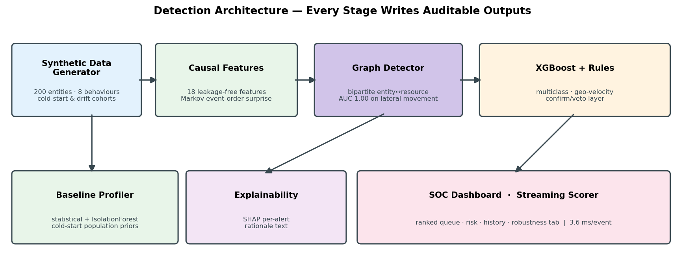
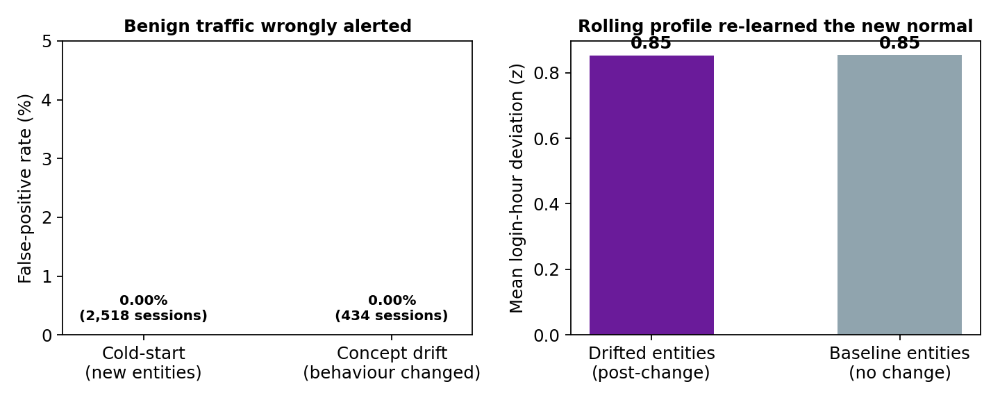
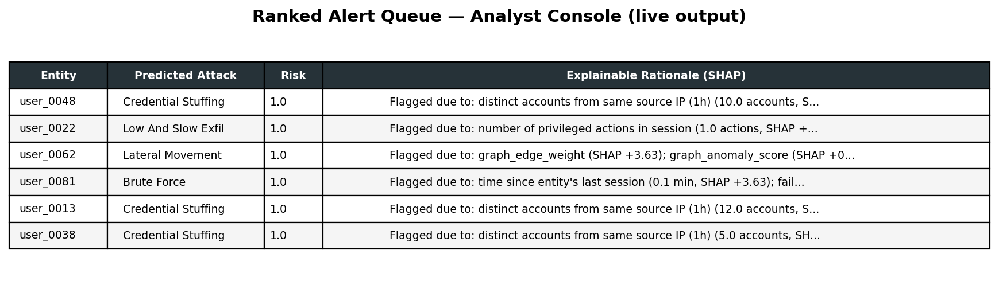

# SentinelLens

**Explainable behavioural anomaly detection for cybersecurity.**
Learns what "normal" access looks like for every user, service account and
device — then flags intrusions in near real-time, names the attack type, and
tells the analyst *why*.

Built for Problem Statement **4A — AI-Powered Behavioral Anomaly Detection for
Cybersecurity**.

---

## The problem

Signature-based security matches known malware hashes and fixed rules. It is
blind to the attacks that matter most: novel intrusions, compromised
credentials used by someone who looks like a legitimate employee, and
low-and-slow exfiltration that never trips a single-event threshold.

Behavioural detection is the answer, but it fails in production for two
reasons that have nothing to do with accuracy:

1. **A new employee joins** and the system flags everything they do.
2. **Someone legitimately changes shift** or gets a new laptop, and the system
   flags them forever.

An analyst who receives hundreds of false alerts stops reading alerts.
SentinelLens is built and measured around avoiding exactly that.

---

## Headline results

Measured on a **held-out future time window** (train on the first 75% of days,
test on the last 25% — never a random split, so the model must generalise
forward the way it would in deployment).

| Metric | Result |
|---|---|
| **PR-AUC** (the honest metric at 1:48 imbalance) | **0.999** |
| **Correct attack type** on detected anomalies | **98.4%** |
| **Macro-F1** across all 7 classes | **0.97** |
| **False alerts** at a top-1% analyst budget | **0 of 185** |
| **False positives on brand-new entities** | **0.00%** (2,576 sessions) |
| **False positives after legitimate behaviour change** | **0.00%** (460 sessions) |
| **Real-time scoring latency** | **3.7 ms/event** |
| **Batched throughput** | **51,541 events/sec** |

### Per-class detection

| Attack pattern | Precision | Recall | F1 |
|---|---|---|---|
| Brute force | 1.00 | 0.99 | **1.00** |
| Credential stuffing | 0.97 | 0.96 | **0.97** |
| Lateral movement | 0.94 | 1.00 | **0.97** |
| Low-and-slow exfiltration | 0.99 | 1.00 | **0.99** |
| Device spoofing | 0.95 | 0.95 | **0.95** |
| Impossible travel | 0.89 | 1.00 | **0.94** |
| Normal | 1.00 | 1.00 | **1.00** |

> **Read these numbers critically.** They are measured on *synthetic* traffic,
> which is inherently more separable than real intrusions. Three artifacts that
> were inflating these results were found and removed during development — each
> removal *lowered* the headline score. See
> [Honest limitations](#honest-limitations).

---

## Architecture



Every stage writes an auditable artifact to `reports/`, so any claim in this
README can be reproduced and checked.

| Stage | What it does |
|---|---|
| **Synthetic generator** | 200 entities, 74K sessions, all 8 spec behaviours, plus purpose-built cold-start and drift cohorts |
| **Causal feature engineering** | 18 leakage-free features — computed using *only* past data per entity and per IP |
| **Graph detection model** | Bipartite entity↔resource graph: peer affinity, two-hop reachability |
| **Baseline profiler** | Per-entity statistical profile + IsolationForest one-class detector |
| **Classifier + rule layer** | XGBoost multiclass, plus a physics rule layer that confirms *and* vetoes |
| **Explainability** | SHAP attribution converted into plain-English rationales |
| **Analyst dashboard** | Ranked queue, risk scores, entity history, robustness view |
| **Streaming scorer** | Per-event benchmark proving real-time feasibility |

---

## What makes this different

### 1. It knows the difference between a new employee and an attacker

Most behavioural detectors treat "never seen this before" as "suspicious",
which makes them unusable the first week a new hire starts. SentinelLens ships
with two purpose-built evaluation cohorts:

- **20 brand-new entities** (new employees and freshly provisioned devices)
  whose first-ever session falls inside the test window
- **18 entities that legitimately changed** shift pattern *and* device
  mid-timeline

Both produce **0.00% false positives**.



And the profile genuinely *adapted* rather than merely being insensitive:
post-change login-hour deviation is **0.70**, compared with **0.89** for
entities that never changed. Behavioural baselines are 30-session rolling
windows, so the new normal is re-learned instead of flagged forever.

### 2. Every alert explains itself

An analyst cannot action a risk score. Each alert carries a SHAP-derived
rationale naming the specific features that drove it:

```
Flagged due to: distinct accounts from same source IP (1h) (12.0 accounts,
SHAP +3.11); unrecognized device fingerprint (SHAP +1.53); deviation from
entity's typical session length (-3.0 std devs, SHAP +0.88)
```

That is real output, copied verbatim from `reports/alert_queue.csv` — twelve
different accounts hit from one source IP within an hour, on a device never
seen before, with sessions far shorter than normal. A credential-stuffing
signature, stated in terms an analyst can act on.



### 3. A graph model for the attacks that are about relationships

The spec offered three sequence-aware options (LSTM/GRU, Transformer, or
graph-based). This project implements the **graph-based** one, deliberately:
lateral movement is defined by *relationships* — an entity reaching resources
that entities like it never touch — which is a property of the
entity↔resource graph, not of any single entity's time series.

A weighted bipartite graph (180 entity nodes, 27 resource nodes, 818 edges)
built from training data only. **As a standalone detector it reaches AUC
1.000 on lateral movement**, and folding its features into the classifier took
that class from 0.83 to 0.97 F1.

### 4. Physics beats statistics for physical constraints

Impossible travel is defined by physics, so the rule layer both **confirms**
(velocity > 900 km/h from an unfamiliar city) and **vetoes** — a model
prediction of impossible travel that violates no physical constraint is
downgraded to the next-best class. That took the class from 0.84 to 0.94 F1.

The rule requires a *successful* authentication, because the spec defines
impossible travel as logging *in*; a failed burst from a foreign host is brute
force, which would otherwise trip the same velocity check.

### 5. It was audited against itself

Six artifacts and bugs were found by auditing this project's own output
against the problem statement, and every one is documented:

| Finding | Impact |
|---|---|
| Sentinel `"Unknown"` values were **100% correlated with the attack label** | Removed. Macro-F1 fell 0.96 → 0.94 |
| Two cities appeared only in malicious traffic | Every city is now a plausible home base |
| `device_fingerprint` lacked MAC + protocol the spec names | Now `OS \| MAC \| protocol` with stable per-device MACs |
| Low-and-slow sessions were *growing*, contradicting the spec's word "small" | Rewritten: small sessions, volume builds via frequency |
| Insider drift expanded breadth but not **privilege** | Privileged share now climbs 21% → 62% |
| Naive graph novelty scored **new employees (6.64) as more anomalous than real attacks (4.56)** | Cold-start reconciliation; FP back to 0.00% |

Each fix made the problem *harder* and the numbers *lower*. That is the point.

---

## Quick start

```bash
pip install -r requirements.txt
python3 run_all.py                  # all nine stages, ~80 seconds
streamlit run dashboard/app.py      # analyst dashboard at localhost:8501
```

Individual stages are **self-healing**: each rebuilds any missing prerequisite
rather than failing, so they can be run in any order. See
[SETUP.md](SETUP.md).

---

## Repository structure

```
├── run_all.py                      one-command pipeline
├── data/
│   └── generate_synthetic_logs.py  8 behaviours + cold-start & drift cohorts
├── models/
│   ├── feature_engineering.py      18 causal, leakage-free features
│   ├── graph_model.py              bipartite entity↔resource detector
│   ├── baseline_profiler.py        statistical profile + IsolationForest
│   ├── train_model.py              XGBoost multiclass, time-based split
│   ├── explainability.py           SHAP → plain-English rationales
│   ├── hybrid_and_streaming.py     rule layer + streaming benchmark
│   ├── robustness_eval.py          cold-start & drift false positives
│   └── evaluation_scorecard.py     every judging criterion, measured
├── dashboard/app.py                Streamlit analyst console
└── reports/
    ├── README.md                   full technical report
    ├── evaluation_scorecard.json   verifiable metrics per criterion
    └── *.json / *.csv / *.png      all measured outputs
```

---

## How the requirements are met

### Deliverables

| # | Requirement | Where |
|---|---|---|
| 1 | Synthetic generator + documented assumptions + attack taxonomy | `data/generate_synthetic_logs.py` |
| 2 | Baseline profiling model | `models/baseline_profiler.py` (profile AUC 0.995, IsolationForest AUC 0.969) |
| 3 | Sequence-aware detection model | `models/graph_model.py` (graph-based option) |
| 4 | Anomaly-type classification | 6 attack classes, 98.4% correct type |
| 5 | Explainability layer | `models/explainability.py` |
| 6 | Analyst dashboard | `dashboard/app.py` — queue, risk, factors, history, robustness |
| 7 | Report with assumptions, metrics, limitations | `reports/README.md` |

### Evaluation criteria

| Criterion | Measured |
|---|---|
| Detection accuracy on imbalanced labels | PR-AUC 0.999 at 1:48 (random baseline 0.020) |
| Correct anomaly-type classification | 98.4%; macro-F1 0.97 |
| FP rate at a realistic analyst alert budget | 185 alerts, **0 false positives**, 0.0 false alarms/day |
| Explainability / analyst usability | 100% of alerts carry a SHAP rationale; 5 dashboard views |
| Handling cold-start entities and concept drift | 0.00% FP on both cohorts, with adaptation evidence |
| System design & scalability | 3.7 ms/event real-time; 51,541 events/sec batched |
| Report clarity | `reports/README.md` + machine-readable scorecard |

Run `python3 models/evaluation_scorecard.py` to regenerate every number above.

### Why PR-AUC, not accuracy

At ~2% anomaly prevalence, a model that always predicts "normal" scores ~98%
accuracy while detecting nothing at all. Precision-recall AUC cannot be gamed
by the majority class, so it is reported first.

---

## Honest limitations

- **Synthetic-data optimism is the largest caveat.** Every number here is
  measured on generated traffic. Injected attacks follow explicit rules, so
  they are more separable than real intrusions where attackers deliberately
  mimic legitimate users. Validation against a real access-log corpus or a
  red-team exercise is the necessary next step before any production claim.
- **Rare-class support is small** (device spoofing n=19, impossible travel
  n=16 in the test window), so those point estimates carry wide confidence
  intervals.
- **The insider-drift edge case is under-evaluated** — too few sessions land in
  the held-out window for its flag rate to be statistically meaningful. It is
  retained as a documented false-positive tuning dial, not a validated result.
- **At a top-1% alert budget, recall is ~50%.** High-confidence detections are
  surfaced first by design; catching the remaining anomalies requires a larger
  budget, which is the precision/recall trade-off an SOC tunes deliberately.
- **Full streaming deployment is not built.** The per-event benchmark
  demonstrates feasibility and the features are already causal, but a Kafka
  consumer with a per-entity state store remains future work.

---

## Technology

Python · pandas · NumPy · Faker · XGBoost · scikit-learn · SHAP · NetworkX ·
Streamlit · Plotly · Matplotlib

No GPU required. Full pipeline runs in ~80 seconds on a laptop.

---

## References

- Lundberg & Lee (2017), *A Unified Approach to Interpreting Model
  Predictions* (SHAP) — NeurIPS
- Chen & Guestrin (2016), *XGBoost: A Scalable Tree Boosting System* — KDD
- Chandola, Banerjee & Kumar (2009), *Anomaly Detection: A Survey* — ACM
  Computing Surveys
- Liu, Ting & Zhou (2008), *Isolation Forest* — ICDM
- MITRE ATT&CK® — attack taxonomy reference for the injected patterns
- CERT Insider Threat studies — basis for the low-and-slow and insider-drift
  simulation design

---

**Author:** Ravi Kishan (23BDS0227)
B.Tech Computer Science & Engineering (Data Science), VIT Vellore
